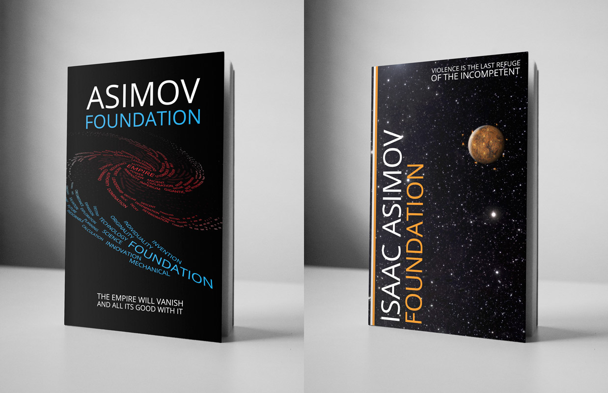

The brief was to create two poster advertisements for a book which was released in 1960 or earlier. The adverts had to be in some way representative of the book, and one had to be explicit and the other implicit. I also decided to mock up book covers based on the poster designs.

The book I chose was the science fiction classic <strong>Foundation</strong> by Isaac Asimov.

The first step was to analyse the book in depth, noting any significant events, characters, items, etc, as well as the overall themes and plot lines of the book. My summary of the book was as follows:

<em>A brilliant mathematician works out a scientific method for reliably predicting the future course of history. His new science tells him that the Galactic Empire is decaying, and will soon fall into a chaos which will last 30,000 years. He uses his knowledge to change the future, with the aim of saving humanity from millenia of suffering by creating a new empire within one thousand years instead.</em>

In addition to representing the book itself, it was important to ensure that the covers evoked the science-fiction genre, and ideally reflect the meticulous, historical style of narration employed by the author.

  

<strong>Explicit:</strong>  The explicit poster is a typographic representation of the overall concept of the book. The Empire in the middle of the galaxy has the appearance of might, solidity and power, but is rotting away at the edges. The Foundation at the tip of the galaxy is fresh and vital, and is expanding inwards. The caption is a quote from the protagonist which encapsulates the book's underlying idea.

  

<strong>Implicit:</strong>  The implicit poster is a digital illustration of an event which takes place in one of the book's sequels, far in the future of the book itself: the sacking of the city planet Trantor, capital of the Galactic Empire. This choice represents the book on a number of levels:

<ul>
  <li>The fact that it depicts an event far in the future from the point of view of the book mirrors the prediction aspect of the story.</li>
  <li>The sacking of Trantor itself is a perfect metaphor for the decay and eventual destruction of what was once a glorious empire.</li>
  <li>Among the chaos of the sacking, only one location remained untouched: the university, which further represents the way the collective knowledge of humanity was protected from complete destruction by the creation of the Foundation.</li>
</ul>

Again, the text is a quote from a main character which is highly relevant to the illustration and the idea behind it.

Both posters fulfil the brief - the explicit poster shows exactly what to expect from the book, while the implicit poster reveals nothing while successfully implying what type of story it is. They also successfully evoke the correct genre, and hint at the detached, historical style of the writing.

Finally, I designed book covers based on the posters, and created mock-ups of the finished books. Each cover includes all of the elements from the poster, but with a more appropriate layout for the purpose.
